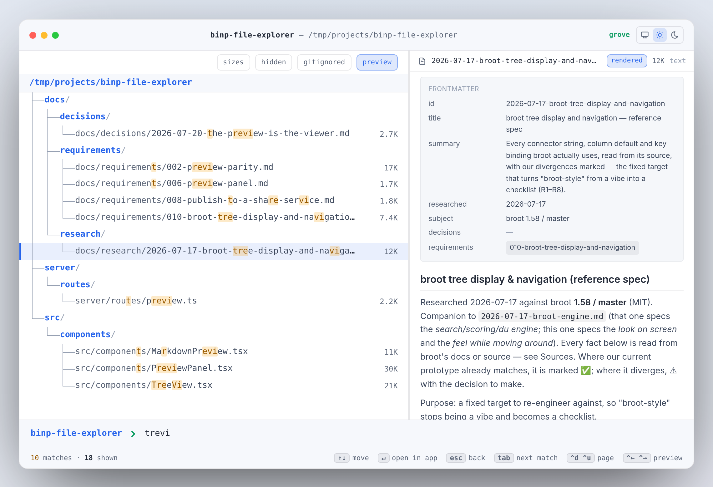

# binp-file-explorer

A **high-speed Bun file explorer** — a web app for browsing a served filesystem
fast.

<!--
  Hero shots: 1440×900 viewport at devicePixelRatio 2 (so the files are 2×),
  one per theme, same tree state. Served root is a checkout copied to a neutral
  path, because the title bar prints the served path verbatim and a home
  directory would publish a username.
-->
<p align="center">
  <picture>
    <source
      media="(prefers-color-scheme: dark)"
      srcset="assets/hero-dark.png"
    />
    <source
      media="(prefers-color-scheme: light)"
      srcset="assets/hero-light.png"
    />
    
  </picture>
</p>

## Goals

- **Incredibly fast.** Bun-native filesystem serving; directory listings and
  file streaming that feel instant even on large trees.
- **Browse and preview in place.** File contents appear in a bounded preview
  panel without leaving the tree; the browser back button walks the navigation
  history naturally. Everything beyond core navigation is async — the tree
  always paints first.

## Stack

Bun · Elysia · React 19 · Tailwind CSS v4 · Vite. See [`AGENTS.md`](AGENTS.md)
for the full breakdown, and
[`docs/requirements/103-engineering-conventions.md`](docs/requirements/103-engineering-conventions.md)
for the conventions the code is held to.

## Develop

```sh
mise install      # Bun toolchain
bun install       # dependencies
mise run dev      # Elysia (:3000) + Vite (:5173) — open http://localhost:5173
```

`mise run typecheck` type-checks; `mise run build` produces `dist/client` +
`dist/server`; `mise run start` runs the production server.

## Install & run as a CLI (`bfe`)

The flake builds a single on-demand executable — `bfe` — that serves a directory
in your browser, broot-style: run it wherever you are in a terminal and it opens
the explorer on the current directory.

```sh
nix run github:binaryplease/file-explorer          # serve the current dir, open the browser
nix run github:binaryplease/file-explorer -- ~/src # serve a specific dir
nix profile install github:binaryplease/file-explorer   # then just: bfe
```

`bfe` **auto-assigns a free port** before launching, so any number of instances
run at once, each on its own port — no flags, no collisions. Pass `-p/--port` to
pin an exact port instead; that bind is strict and fails loudly if the port is
taken. The served root is a **starting anchor, not a boundary** — you
can browse up and out of it (matching `broot` opened from anywhere). Pass
`--confine` to make the root a real boundary.

```
bfe [path]                Serve a directory (default: current) and open the browser
bfe daemon start [path]   Run it in the background (idempotent — restarts if running)
bfe daemon stop           Stop the background server
bfe daemon restart        Restart it (keeps the same root if none is given)
bfe daemon status         Is the daemon alive and responding?
bfe daemon logs [N]       Tail the last N daemon log lines
bfe status                Full operational view (served root, uptime, port) + discovery links
bfe help                  All commands and flags
```

The daemon is a single background server (PID at
`$XDG_RUNTIME_DIR/binp-file-explorer.pid`, logs at
`~/.local/share/binp-file-explorer/`); it forks detached, is torn down by
process-group signal, and reports its full state at `/api/status`. For a hosted
box, the flake also ships `nixosModules.default` (`services.binp-file-explorer`)
— a systemd unit with the standard hardening (read-only filesystem, no
capabilities, restricted syscalls), loopback-bound and confining by default.

## Serving a location

The explorer serves the **home directory** of the user running the server by
default. To open it at a specific location instead, set `EXPLORER_ROOT` (see
`.mise.toml`) or pass a positional argument: `bun server/index.ts ~/projects`.

A dev session serves **this repo**, so it opens on the code you are working on
rather than your home directory: `.mise.toml` pins `EXPLORER_ROOT` for the mise
tasks, and `scripts/dev-root.ts` applies the same default inside `scripts/dev.ts`
for `bun dev`, which never reads that file. Exporting `EXPLORER_ROOT` yourself
overrides both. This is a dev-env convention, not a code default — the server
started on its own (`bun dev:server`, `bun server/index.ts`) still falls back to
the home directory, and `bfe` serves its own cwd either way.

By default the root is the tree's **starting anchor**, not a boundary: browsing
can follow a symlink or an absolute path out of it. Set `EXPLORER_CONFINE=true`
to make the root a real boundary instead: paths that escape it, lexically or
through a symlink, are then refused, and escaping entries are listed with their
target's metadata withheld.

## Security model

This is a **local-only** tool. It binds to loopback, ships no CORS headers, and
runs with the filesystem privileges of the user who started it — so the browser
is the threat to design against, not the network.

The control that does the work is **Host-header validation**: the server answers
only for loopback names. Without it, DNS rebinding (an attacker's domain pointed
at 127.0.0.1) makes any page the user visits same-origin with the explorer, and
the same-origin policy stops protecting the responses. `EXPLORER_ALLOWED_HOSTS`
(comma-separated) is the deliberate opt-out for a `HOST=0.0.0.0`-behind-Caddy
deployment; anything not loopback and not named there gets a 421.

The Host check only works against **browsers**, which cannot forge a Host
header — it is not access control, since any other client can send
`Host: localhost` and pass it. What keeps the network out is the loopback bind,
so removing it is treated as a deliberate act: with a non-loopback `HOST` and an
empty `EXPLORER_ALLOWED_HOSTS`, the server **refuses to start**. To deploy that
way, front the port with an *authenticating* reverse proxy and name the host(s)
it serves in `EXPLORER_ALLOWED_HOSTS`. Doing so while `EXPLORER_CONFINE` is off
starts with a warning: unconfined mode resolves absolute paths, so the whole
filesystem readable by the server's user is reachable, not just
`EXPLORER_ROOT`.

`EXPLORER_CONFINE` is **not** that control, which is why it defaults to off:
`EXPLORER_ROOT` defaults to the user's home directory, so a confined server
still exposes `~/.ssh` and `~/.gnupg` to anything that gets past the origin
check. Confinement is for a genuinely hosted surface serving a subtree that is
not the user's own — turn it on together with an `EXPLORER_ROOT` worth
confining to.

**Embedding (CORS).** Shipping no CORS headers is the default because the
same-origin policy is what guards the responses. A host app that mounts this
explorer's frontend into its own page while running this server as a separate
process on another port makes cross-origin requests the
browser would otherwise refuse to read. `EXPLORER_ALLOWED_ORIGINS`
(comma-separated exact Origins) is the deliberate opt-in for exactly that seam:
the server reflects CORS headers back to a listed Origin and no other, leaving
the loopback bind and the Host check fully intact. Empty (the default) means no
cross-origin access at all — nothing is loosened unless an operator names the
Origin.

## Status

Prototype: broot-style navigation (tree with lazy expansion, keyboard-first
navigation with broot's default keys — `↵`/`→` open, `←`/`esc` back through
history, `h`/`⌫` parent, `j`/`k` move, `ctrl-d`/`ctrl-u` page,
`tab`/`shift-tab` walk matches — size bars, hidden and gitignored toggles,
deep-linkable focus via `?path=` with natural back-button history), styled
with the grove token palette (`src/theme.css`). Typing fuzzy-searches the whole
focused subtree server-side with broot's scored-match algorithms re-engineered
in TypeScript
(bounded best-first walk, gitignore-aware pruning, results ranked by score
with the best match pre-selected). Pressing `↵`/`→` on a file opens it with the
operating system's default application on the host machine (via
`POST /api/fs/open` — this is a local-only, loopback tool, so that's your own
machine); `/api/fs/raw` still serves raw bytes for download/preview. A **preview
panel** (`GET /api/fs/preview`, `ctrl/cmd-→` to open) shows the head of the
selected text file, renders small images, summarizes directories, and marks
binary / too-large / empty / unpreviewable entries rather than dumping bytes —
reads are bounded, so a 40 GB log previews as cheaply as a 4 KB one, and the
request is deferred past the paint and aborted the moment the selection moves.
A line is never clipped: the read stops *between* lines (1 MiB / 4000 lines per
selection), and when it stops short the panel says so loudly — how many bytes
are missing, what share is on screen, and a **load whole file** button that
re-reads to a far larger ceiling.
Not yet built: git status, directory sizing, broot's computed screen-fit
openness (R8 — manual expand/collapse kept for now as a deliberate departure).

Preview focus follows broot's two-step model: `ctrl/cmd-→` opens the panel
(keyboard stays in the tree), a second `ctrl/cmd-→` hands the keyboard to the
panel so the arrows scroll it; `ctrl/cmd-←` hands it back, and a second
`ctrl/cmd-←` closes the panel.

Deviation from broot's keyboard shortcuts: broot reveals hidden and gitignored
files through two independent toggles (`:toggle_hidden` / `:toggle_git_ignore`,
Alt-h / Alt-i by default). We add `alt+a` on top of those — a one-stroke
"reveal everything" that flips both views together (both on / both off).

## Contributing

Patches welcome. [`CONTRIBUTING.md`](CONTRIBUTING.md) has the setup, the three
gates every pull request must pass, and the one rule most likely to send a patch
back — everything beyond the core navigation loop must be async and
non-blocking. [`AGENTS.md`](AGENTS.md) is the full build manual, and
[`CODE_OF_CONDUCT.md`](CODE_OF_CONDUCT.md) applies to everyone taking part.

## Security

Found a way for a web page, another machine, or a crafted filename to do
something it should not? **Do not open an issue.**
[`SECURITY.md`](SECURITY.md) has the private reporting path, plus what is in
scope — worth reading first, because the two most commonly reported behaviours
(no authentication, and reading outside the served root) are documented design
rather than bugs. See [Security model](#security-model) above for why.

## License

MIT — see [`LICENSE`](LICENSE). Copyright (c) 2026 Enrico Scherlies.

Dependencies are permissively licensed throughout, and the bundled Inter font is
under the SIL Open Font License 1.1 — its notice, and everything else that must
travel with a build of this project, is in
[`THIRD-PARTY-NOTICES.md`](THIRD-PARTY-NOTICES.md).
